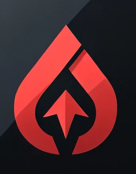

<p align="center">
  
  <br>
  <span style="font-size:large; font-weight:bold">TORRENT CLIENT</span>
</p>

## 📱 Flutter Torrent Downloader - iOS Application

Welcome to the repository of the **Flutter Torrent Downloader**, an iOS application developed in Flutter that allows you to download and manage torrents directly on your iPhone. Unfortunately, due to restrictions imposed by the App Store, this application cannot be published on Apple's official platform. [Learn more about App Store restrictions](https://developer.apple.com/app-store/review/guidelines/).

## 🚀 Features

- **Torrent Downloading**: Download yours torrents
- **Torrent Handling**: Open `.torrent` files directly with the app You can import torrents via the app or use iOS sharing to open a `.torrent` file directly in the app.
- **Downloaded Files Management**: Access all your downloaded files directly from the app.
- **Real-time Tracking**: View the status of each download, with information such as speed, downloaded percentage;
- **Secure and Private**: No data is collected by the app, your privacy is respected.
- **No ads** : NO ADS !!

## 📝 To Do

- [ ] **Improve background downloading**: Currently, iOS system interrupts downloads when the app loses focus.
- [ ] **Add a "Add Torrent" button**: Implement a button to allow users to easily add new torrents.
- [ ] **Add a notification for completed downloads**: Notify users when a download has finished.
- [ ] **Optimize last piece downloading**: Enhance the downloading process for the last piece. If the download is stuck at 0 KB/s with peers and seeders, just click the option "wake up" on the download.
- [ ] **iPad support**: Adapt the application for a better experience on iPad.

## 🛠️ Installation

### Prerequisites

- **Flutter SDK**: Make sure you have Flutter installed on your machine. [Installation guide](https://flutter.dev/docs/get-started/install)
- **Xcode**: You will need Xcode to compile and deploy the application on an iOS device.
- **Apple Account**: An Apple developer account is necessary to sign and deploy applications on an iPhone.

### Installation Steps

1. **Clone the repository**

   ```bash
   git clone https://github.com/miine/Simple-IOS-Torrent-Client-Flutter.git
   cd Simple-IOS-Torrent-Client-Flutter
   ```
2. **Dependency Installation**

   Use `flutter pub get` to install all project dependencies:

   ```bash
   flutter pub get
   ```

3. **Configure Signing Certificates**

   Open the Flutter project in Xcode to configure the signing certificates:

   ```bash
   open ios/Runner.xcworkspace
   ```

   - Select the project in the left sidebar.
   - Go to the "Signing & Capabilities" tab.
   - Make sure your Apple developer account is selected for signing.

4. **Compile and Deploy on an iPhone**

   Connect your iPhone to your computer, then run the following command to compile and deploy the application on your device:

   ```bash
   flutter run
   ```

   You can also use Xcode to deploy the application by pressing the "Run" button.

## 📜 License
This project is under the MIT license. Please see the LICENSE file for more information.

## 🧑‍💻 Contribute
Contributions are welcome! Feel free to open an issue or a pull request to propose improvements.

## 📬 Contact
If you have any questions or suggestions, don't hesitate to contact me via your email or create an issue in this repository.√


## 📚 Libraries Used

This project relies on several libraries that have been essential in building the Flutter Torrent Downloader. Special thanks to the amazing `D_torrent` library for its contributions to torrent parsing and task management.

### Libraries

- **[receive_sharing_intent](https://pub.dev/packages/receive_sharing_intent)**: Allows the app to handle shared content from other applications.
- **[dtorrent_parser](https://pub.dev/packages/dtorrent_parser)**: Used for parsing torrent files. This library simplifies working with torrent metadata.
- **[dtorrent_task](https://github.com/miine/dtorrent_task.git)**: An essential library for managing torrent tasks. Currently, we are using a local fork of this library as we needed to make some modifications. Special thanks to the maintainers for their original work and support!
- **[downloadsfolder](https://pub.dev/packages/downloadsfolder)**: Provides access to the downloads folder on the device.
- **[flutter_riverpod](https://pub.dev/packages/flutter_riverpod)**: A state management library that helps in managing app state efficiently.
- **[provider](https://pub.dev/packages/provider)**: Another state management solution used in conjunction with Riverpod.
- **[open_file](https://pub.dev/packages/open_file)**: Allows the app to open files with other applications.
- **[wakelock](https://pub.dev/packages/wakelock)**: Prevents the device from going to sleep during downloads.

We sincerely appreciate the work of all these library maintainers and contributors. Their efforts have made it possible to build and enhance this application.

